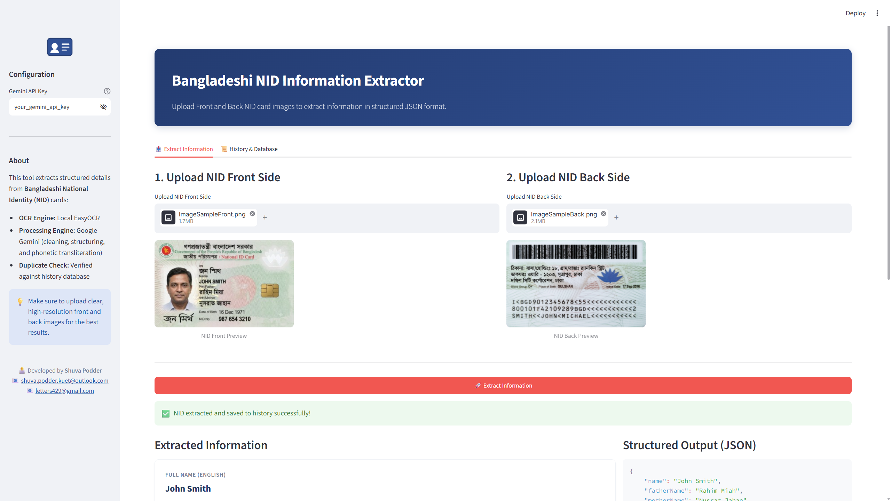
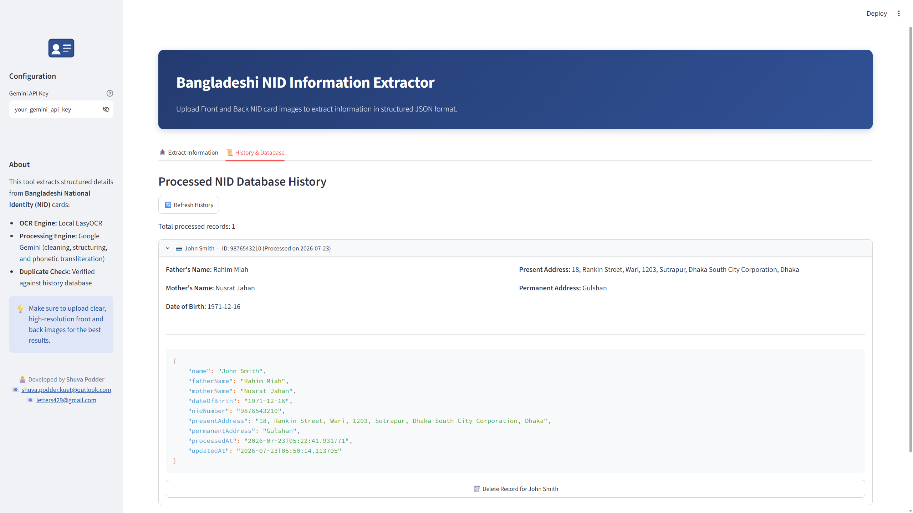

# Bangladeshi National ID (NID) Information Extraction System

An end-to-end, AI-powered document intelligence microservice designed to extract, clean, structure, and transliterate information from both sides of Bangladeshi National Identity (NID) cards into standardized English JSON output.

The system combines computer vision image preprocessing (OpenCV CLAHE), offline OCR (EasyOCR), structured AI parsing via Google Gemini (`google-genai`), a FastAPI REST engine, and an interactive Streamlit frontend, all fully containerized with Docker & Docker Compose.

---

## 📸 Screenshots & Architecture

### 1. Extraction & Parsing Interface

*Streamlit interface displaying NID card image uploads, preview cards, extraction status, structured key-value fields, and JSON output.*

---

### 2. History & Database Management

*Interactive history and database tab displaying stored records, expandable JSON data, and record management controls.*

---

### 3. System Architecture & Pipeline

```
                       ┌─────────────────────────────────────────┐
                       │           Streamlit Web UI              │
                       │           (Port 8501)                   │
                       └──────────────────┬──────────────────────┘
                                          │ HTTP POST (Multipart Image Files)
                                          ▼
                       ┌─────────────────────────────────────────┐
                       │           FastAPI REST API              │
                       │           (Port 8000)                   │
                       └──────────────────┬──────────────────────┘
                                          │
                                          ▼
                       ┌─────────────────────────────────────────┐
                       │     OpenCV Preprocessing Engine         │
                       │     (Grayscale + CLAHE Enhancement)     │
                       └──────────────────┬──────────────────────┘
                                          │
                                          ▼
                       ┌─────────────────────────────────────────┐
                       │       Local EasyOCR Engine              │
                       │     (Bangla + English Text Bounds)      │
                       └──────────────────┬──────────────────────┘
                                          │
                                          ▼
                       ┌─────────────────────────────────────────┐
                       │      Google Gemini AI Engine            │
                       │ (Structured Schema & Transliteration)   │
                       └──────────────────┬──────────────────────┘
                                          │
                                          ▼
                       ┌─────────────────────────────────────────┐
                       │      Pydantic Data Sanitization         │
                       │      (NID Digits & Field Checks)        │
                       └──────────────────┬──────────────────────┘
                                          │
                                          ▼
                       ┌─────────────────────────────────────────┐
                       │       Persistent JSON Database          │
                       │      (data/processed_nids.json)         │
                       └─────────────────────────────────────────┘
```

---

## ✨ Key Features

* **Dual-Side NID Processing**: Processes both Front and Back NID images concurrently to capture full identity details.
* **OpenCV Image Enhancement**: Automatically converts uploaded images to grayscale and applies Contrast Limited Adaptive Histogram Equalization (CLAHE) to improve text clarity on poorly lit or noisy card photos.
* **Contextual Bangla-to-English Transliteration**: Performs phonetic transliteration for names and addresses instead of literal word-for-word translation, producing natural English names (e.g., `স্বপন পোদ্দার` $\rightarrow$ `Swapan Podder`).
* **Strict Address Segregation**: Explicitly differentiates Present Address (`ঠিকানা`) from Permanent Address (`Place of Birth` / `জন্মস্থান`), eliminating common OCR cross-field leakage.
* **Smart Duplicate Detection & Resolution**: Checks extracted NID numbers against persistent storage. When a duplicate is detected, the system presents a side-by-side comparison allowing the user to review and electively update the existing record.
* **Graceful Degradation**: If the back card image is missing or unreadable, the system returns front-side data with clear warning messages rather than failing completely.
* **Schema Validation & Sanitization**: Validates NID length standards (10, 13, or 17 digits) and ensures mandatory identity fields are non-empty using Pydantic.
* **Fully Containerized Deployment**: Multi-stage Docker builds separating heavy backend dependencies (PyTorch/EasyOCR) from light UI layers, orchestrated seamlessly via Docker Compose.

---

## 🛠️ Technology Stack

| Component | Technology / Library | Purpose |
| :--- | :--- | :--- |
| **Backend Framework** | FastAPI (Python 3.12) | High-performance asynchronous REST API |
| **Frontend UI** | Streamlit 1.60 | Interactive web interface with tabbed navigation |
| **Image Preprocessing** | OpenCV (`opencv-python-headless`) | Grayscale conversion & CLAHE adaptive contrast tuning |
| **OCR Engine** | EasyOCR (`easyocr`) | Offline optical character recognition for English and Bangla |
| **LLM & Structuring** | Google GenAI (`google-genai` v2.13) | `gemini-3.1-flash-lite` for text cleaning, transliteration, and JSON schema enforcement |
| **Data Validation** | Pydantic v2 | Strict schema validation, NID format checks, and error handling |
| **Storage** | JSON Storage (`data/processed_nids.json`) | Lightweight persistent storage with volume mapping |
| **Containerization** | Docker & Docker Compose | Containerized orchestration and environment consistency |

---

## 🧠 AI Integration & Development Methodology

### 1. AI Tooling Usage
During the development lifecycle, AI tools were leveraged strategically across different phases:
* **Problem Domain & Requirements Analysis**: Used **Sonnet 5 (Claude)** to analyze Bangladeshi NID structural nuances, format variations (Smart Card 10-digit, Old 13-digit and 17-digit), and draft the baseline Streamlit UI component framework.
* **Backend Architecture & Refinement**: Leveraged **Gemini 3.5 Flash** and **Gemini 3.1 Pro** to iterate on backend route logic, structure OpenCV preprocessing pipelines, formulate Pydantic validation rules, and optimize prompt engineering for Gemini's structured output.

### 2. Engineering Decisions & Architecture Rationale
* **Direct Gemini API vs. Frameworks (e.g., LangChain)**:
  While frameworks like LangChain offer high abstractions for complex multi-step chains, direct integration with the official `google-genai` SDK was chosen for simplicity. Using `GenerateContentConfig(response_schema=NIDDetails)` provided deterministic JSON schema adherence directly without unnecessary framework complexity.
* **Division of Work**:
  * **Frontend**: Rapidly prototyped with AI assistance and customized with bespoke CSS for a polished presentation.
  * **Backend**: Deeply hand-engineered and iteratively refined. Special attention was placed on OpenCV CLAHE adaptive contrast tuning in the preprocessing stage to enhance local contrast and improve OCR detection accuracy on poorly lit images, regex digit sanitization, Pydantic field validators, duplicate state resolution, and API error code handling (400, 401, 422, 429, 503).

### 3. Iterative Prompt Engineering & Edge-Case Handling
The system leverages Gemini's structured outputs via the `NIDDetails` schema (`response_schema=NIDDetails`) to enforce strict data types, field descriptions, and edge-case handling rules:

* **Phonetic Transliteration**: Phonetically converts Bangla names (`পিতা`, `মাতা`) and Present Address (`ঠিকানা`) into standard English.
* **Strict Address Segregation**: Differentiates Present Address (`ঠিকানা`) from Permanent Address (`Place of Birth` / `জন্মস্থান`) to eliminate cross-field leakage.
* **Format Standardisation**: Standardizes Date of Birth (`YYYY-MM-DD`) and extracts NID numbers as clean digit strings.

#### Enforced Extraction Schema (`NIDDetails`)
```python
class NIDDetails(BaseModel):
    name: str             # English title-cased name from front card
    fatherName: str       # Transliterated Father's Name from Bangla
    motherName: str       # Transliterated Mother's Name from Bangla
    dateOfBirth: str      # Format: YYYY-MM-DD
    nidNumber: str        # Digits only (10, 13, or 17 digits)
    presentAddress: str   # Transliterated Present Address (labeled 'ঠিকানা')
    permanentAddress: str # Transliterated or English Permanent Address (labeled 'Place of Birth' / 'জন্মস্থান')
```
*For the full prompt string and instruction details, see backend.py (L372-L394)*

---

## 🚀 Getting Started

### Prerequisites
* [Docker Desktop](https://www.docker.com/products/docker-desktop/) installed and running.
* A **Google Gemini API Key** from [Google AI Studio](https://aistudio.google.com/api-keys).

---

### Setup Instructions

1. **Clone the Repository**
   ```bash
   git clone https://github.com/shin890/Bangladeshi_National_ID_Information_Extraction.git
   cd Bangladeshi_National_ID_Information_Extraction
   ```

2. **Configure Environment Variables**
   Copy `.env.example` to create your `.env` file:
   ```bash
   cp .env.example .env
   ```
   Open `.env` and insert your Gemini API Key:
   ```env
   GEMINI_API_KEY=your_actual_gemini_api_key_here
   ```
   *(Note: The API key can also be provided directly through the Streamlit UI sidebar).*

---

### Running via Docker Compose (Recommended)

To build and launch both backend and frontend containers, run:

```bash
docker compose up --build
```

Once the build finishes:
* **Frontend Web Application**: Open [http://localhost:8501](http://localhost:8501) in your browser.
* **Backend REST API Docs**: Open [http://localhost:8000/docs](http://localhost:8000/docs) to view interactive Swagger UI documentation.

To stop the containers:
```bash
docker compose down
```

---

### Local Development Setup (Alternative)

If you prefer running the application outside Docker:

1. **Set Up Python Virtual Environment**
   ```bash
   python -m venv venv
   source venv/bin/activate  # On Windows: venv\Scripts\activate
   ```

2. **Start Backend Service**
   ```bash
   pip install -r requirements_backend.txt
   uvicorn backend:app --host 127.0.0.1 --port 8000 --reload
   ```

3. **Start Frontend Application** (in a separate terminal)
   ```bash
   pip install -r requirements_frontend.txt
   streamlit run frontend.py
   ```

---

## 📡 REST API Documentation

### Base URL: `http://localhost:8000`

| Endpoint | Method | Description |
| :--- | :--- | :--- |
| `/api/extract` | `POST` | Upload front & back NID images to extract, structure, and save NID details. |
| `/api/history` | `GET` | Retrieve the complete array of stored NID records. |
| `/api/update` | `POST` | Overwrite an existing record in history using `nidNumber`. |
| `/api/delete/{nid_number}` | `DELETE` | Remove a record from history matching the specified NID number. |

---

### Sample Request: `POST /api/extract`

* **Headers**: `X-Gemini-API-Key` *(optional if set in `.env`)*
* **Form-Data**:
  * `front_image`: `[File]` (JPG, JPEG, PNG)
  * `back_image`: `[File]` (JPG, JPEG, PNG)

#### Sample Response (`200 OK`)
```json
{
  "data": {
    "name": "Swapan Podder",
    "fatherName": "Subal Podder",
    "motherName": "Gouri Podder",
    "dateOfBirth": "1995-10-12",
    "nidNumber": "19952692512000123",
    "presentAddress": "Village: Pairabund, Post: Pairabund, Upazila: Mithapukur, District: Rangpur",
    "permanentAddress": "Rangpur"
  },
  "already_processed": false,
  "existing_data": null,
  "front_raw_text": "...",
  "back_raw_text": "...",
  "message": "NID information processed and saved successfully.",
  "warnings": []
}
```

---

## 📂 Repository Structure

```text
Bangladeshi_National_ID_Information_Extraction/
├── .dockerignore
├── .env.example
├── .gitignore
├── Dockerfile.backend
├── Dockerfile.frontend
├── README.md
├── backend.py
├── docker-compose.yml
├── frontend.py
├── requirements_backend.txt
├── requirements_frontend.txt
├── sampleImages/
│   ├── ImageSampleBack.png
│   └── ImageSampleFront.png
└── screenshots/
    ├── 1.png
    └── 2.png
```

---

## 👨‍💻 Author & Contact

**Shuva Podder**  
* 📧 Email: [shuva.podder.kuet@outlook.com](mailto:shuva.podder.kuet@outlook.com) / [letters429@gmail.com](mailto:letters429@gmail.com)
* 🐙 GitHub: [shin890](https://github.com/shin890)
